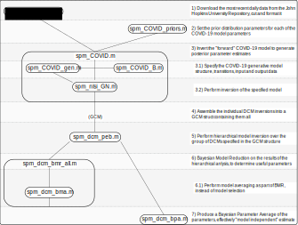

# DCM

A repository for the COVID Dynamic Causal Model from the [SPM12 software](https://github.com/spm/spm12), ported to be an standalone in the [Octave](https://www.gnu.org/software/octave/index) programming language that is backward compatible with MATLAB. 

Alongside this repository, we have also written about this work. See the [technical blogpost]() covering the theory of this repository, and a [practical blogpost]() discussing this implementation.

# Usage 

**Install**
1. Install [Octave](https://www.gnu.org/software/octave/index) (or [MATLAB](https://uk.mathworks.com/products/matlab.html))
2. Clone the (repo)
3. That’s it

**Run**
1. Navigate to the top level directory of the repository
2. Run the command `DEM_COVID();`
3. A full run will take 10-20 hours in Octave

**Run tests (optional)**
1. Navigate to the top level directory of the repository
2. Run the command `DEM_COVID_tests();`
3. Tests should take in the region of 3 minutes to execute in Octave, and report success in all tests when done

# Architecture
Two brief notes to those not familiar with Octave/MATLAB:

1. In Octave and MATLAB, each global function must be implemented in it’s own separate file
2. The SPM software from which we have ported our standalone follows many other MATLAB and Octave programs in basing most data storage and manipulation in the Struct data type.

The structure of the program can be seen visually as follows:

Walking through this, up to date real world COVID-19 data is imported from the DATA_COVID_JHU function, and formatted for further processing. The data for each individual country is passed separately to the SPM_COVID.m function. This takes the countries data, a generative model specified by spm_COVID_gen (with transition matrix specified by spm_COVID_B) and priors specified by spm_COVID_priors and creates a model that it calls the spm_nlsi_GN.m function to invert.

This produces a DCM for each country, which is then assembled into the GCM cell array, containing all countries. This GCM cell array is then passed to the spm_dcm_peb.m function, which estimates a hierarchical model across all countries. This is one of the useful end results of the routine.

There are two outputs from this hierarchical model, a GCM array containing the hierarchical dynamic model, and a DCM array containing individual first level models. We analyse the usefulness of the parameters of this model using Bayesian Model Reduction, using the spm_dcm_bmr_all.m function (which calls spm_dcm_bma.m). The DCM array the individual first level models with empirical parameter estimates. We generate a “model free” estimate of parameters across these models using bayesian parameter averaging using the spm_dcm_bpa.m function. 

# Key Functions
The key functions in realising the COVID-19 DCM, modelling in Figure 1. This is broadly adapted from the documentation provided within SPM12, with some updates and some omissions fixed. 

## DEM_COVID.m
Central function that runs the COVID-19 Analysis. Caller of all functions below. 

*Inputs:* NA

*Outputs:* NA

## DATA_COVID_JHU.m
Download and import function of up-to-date COVID data. Pulls from a github repository provided by John Hopkins University, which is updated daily with COVID pandemic data, and processes it into a suitable format to be operated on by later functions.

This function (especially in Octave) is very much tuned for the data as formatted in this specific github repository, and is unlikely to work on any others.

*Inputs:*
* **n** - the number of countries to retain in the dataset (default 16)

*Outputs:*
* **data** - struct containing formatted data from the n countries. Fields:
    * **data(k).country** - country
    * **data(k).pop** - population size
    * **data(k).lat** - latitude
    * **data(k).long** - longitude
    * **data(k).date** - date when more than one case was reported
    * **data(k).cases** - number of cases,  from eight days prior to first cases
    * **data(k).death** - number of deaths, from eight days prior to first cases
    * **data(k).recov** - number recovered, from eight days prior to first cases
    * **data(k).days** - number of days in time series
    * **data(k).cum** - cumulative number of deaths

## spm_COVID.m
Model inversion for the COVID-19 model. Mostly specifies a few COVID-19 specific DCM parameters then calls the generic DCM inversion function spm_nlsi_GN.m to do the actual inversion itself.

*Inputs*:
* **Y**  - timeseries data
* **pE**  - prior expectation of parameters
* **pC**  - prior covariances of parameters
* **hC**  - prior covariances of precisions

*Outputs*:
* **F**  - log evidence (negative variational free energy)
* **Ep**  - posterior expectation of parameters
* **Cp**  - posterior covariances of parameters
* **pE**  - prior expectation of parameters
* **pC**  - prior covariances of parameters
* **Eh** - posterior log-precisions

## spm_nlsi_GN.m
Generic routine for inverting a DCM model, using expectation maximisation to find the maximised free energy, and the related estimates of the posterior probability distribution functions of the parameters of the DCM.

*Inputs:*
* **M** - Model structure
    * **M.G** (or M.IS) - function name f(P,M,U) - a generative model. Specifies the dynamical systems model of the system to be inverted. Defaults to the spm_int function (not implemented in the standalone) if no option is specified. In the COVID-19 DCM, we specify this as spm_COVID_gen, the function which specifies our COVID-19 dynamical system. 
    * **M.FS** - function name f(y,M)   - feature selection. This [optional] function performs feature selection.
    * **M.P**  - starting estimates for model parameters [optional]
    * **M.pE** - prior expectation      - E{P}   of model parameters
    * **M.pC** - prior covariance       - Cov{P} of model parameters
    * **M.hE** - prior expectation      - E{h}   of log-precision parameters
    * **M.hC** - prior covariance       - Cov{h} of log-precision parameters
* **U** - Input structure
    * **U.u** - inputs (or just U)
    * **U.dt** - sampling interval
* **Y** - Output structure
    * **Y.y**  - outputs (samples (time) x observations (first sort) x ...)
    * **Y.dt** - sampling interval for outputs
    * **Y.X0** - confounds or null space      (over size(y,1) samples or all vec(y))
    * **Y.Q**  - q error precision components (over size(y,1) samples or all vec(y))

*Outputs:*
* **Ep**  - (p x 1)         conditional expectation    E{P|y}
* **Cp**  - (p x p)         conditional covariance     Cov{P|y}
* **Eh**  - (q x 1)         conditional log-precisions E{h|y}
* **F**  - [-ve] free energy F = log evidence = p(y|f,g,pE,pC) = p(y|m)
* **L** - Components of F. Optional, not used in the COVID-19 DCM.
* **dFdp** - Gradient. Optional, not used in the COVID-19 DCM.
* **dFdpp** - Curvature. Optional, not used in the COVID-19 DCM.

## spm_COVID_gen.m
Generative model for the COVID-19 DCM. Generates predictions and hidden states of a COVID model. Used by spm_COVID.m as the generative function for model inversion.

*Inputs:*
* **P** - model parameters
* **M** - model structure (requires M.T - length of time series)
* **U** - number of output variables [default: 2] or indices e.g., [4 5]

*Outputs:*
* **Z{t}** - joint density over hidden states at the time t
* **Y(:,1)**  - number of new deaths
* **Y(:,2)**  - number of new cases
* **Y(:,3)**  - CCU bed occupancy
* **Y(:,4)**  - effective reproduction rate (R)
* **Y(:,5)**  - population immunity (%)
* **Y(:,6)**  - total number of tests
* **Y(:,7)**  - contagion risk (%)
* **Y(:,8)**  - prevalence of infection (%)
* **Y(:,9)**  - number of infected at home, untested and asymptomatic
* **Y(:,10)** - new cases per day
* **X**     - (M.T x 4) marginal densities over four factors
    * **location**   : {'home','out','CCU','morgue','isolation'};
    * **infection**  : {'susceptible','infected','infectious','immune','resistant'};
    * **clinical**   : {'asymptomatic','symptoms','ARDS','death'};
    * **diagnostic** : {'untested','waiting','positive','negative'}

## spm_COVID_priors.m
Specify the prior expectations and covariances of the COVID-19 generative models parameters. Used by spm_COVID.m to specify priors for the generative model.

*Inputs:*
* **NA**

*Outputs:*
* **pE**          - prior expectation (structure)
* **pC**          - prior covariances (structure)
* **str.factor**  - latent or hidden factors
* **str.factors** - levels of each factor
* **str.outcome** - outcome names (see spm_COVID_gen)
* **str.names**   - parameter names
* **str.field**   - field names of random effects
* **rfx**         - indices of random effects

## spm_COVID_B.m
Specify the probability transition matrix for the COVID-19 DCM.

*Inputs:*
* **x** - probability distributions (tensor)
* **P** - model parameters
* **r** - marginals over regions

*Outputs:*
* **T**  - probability transition matrix

## spm_dcm_peb.m
Perform hierarchical inversion across a group DCMs (or an individual DCM, see file for details). We specify the parameters to be considered as random (global) effects and those to be treated as fixed (local model specific) effects using the fields function. 

*Inputs:*
* **DCM**    - {N [x M]} structure array of DCMs from N subjects
    * **DCM{i}.M.pE**   - prior expectation of parameters
    * **DCM{i}.M.pC**   - prior covariances of parameters
    * **DCM{i}.Ep**     - posterior expectations
    * **DCM{i}.Cp**     - posterior covariance
    * **DCM{i}.F**      - free energy
* **M** - Model specification
    * **M.X**      - 2nd-level design matrix: X(:,1) = ones(N,1) [default]
    * **M.bE**     - 3rd-level prior expectation [default: DCM{1}.M.pE]
    * **M.bC**     - 3rd-level prior covariance  [default: DCM{1}.M.pC/M.alpha]
    * **M.pC**     - 2nd-level prior covariance  [default: DCM{1}.M.pC/M.beta]
    * **M.hE**     - 2nd-level prior expectation of log precisions [default: 0]
    * **M.hC**     - 2nd-level prior covariances of log precisions [default: 1/16]
    * **M.maxit**  - maximum iterations [default: 64]
    * **M.Q**      - covariance components: {'single','fields','all','none'}
    * **M.alpha**  - optional scaling to specify M.bC [default = 1]
    * **M.beta**   - optional scaling to specify M.pC [default = 16] - if beta equals 0, sample variances will be used NB: the prior covariance of 2nd-level random effects is: exp(M.hE)*DCM{1}.M.pC/M.beta [default DCM{1}.M.pC/16] NB2: to manually specify which parameters should be assigned to which covariance components, M.Q can be set to a cell array of[nxn] binary matrices, where n is the number of DCM parameters. A value of M.Q{i}(n,n)==1 indicates that parameter n should be modelled with component i.
    **M.Xnames** - cell array of names for second level parameters [default: {}]
* **field** - parameter fields in DCM{i}.Ep to optimise [default: {'A','B'}] 'all' will invoke all fields. This argument effectively allows one to specify the parameters that constitute random effects.

*Outputs:*
* **PEB** - hierarchical dynamic model
    * **PEB.Snames**    - string array of first level model names
    * **PEB.Pnames**    - string array of parameters of interest
    * **PEB.Pind** - indices of parameters at the level below
    * **PEB.Pind0** - indices of parameters in spm_vec(DCM{i}.Ep)
    * **PEB.Xnames**    - names of second level parameters
    * **PEB.M.X** - second level (between-subject) design matrix
    * **PEB.M.W** - second level (within-subject) design matrix
    * **PEB.M.Q** - precision [components] of second level random effects
    * **PEB.M.pE** - prior expectation of second level parameters
    * **PEB.M.pC** - prior covariance of second level parameters
    * **PEB.M.hE** - prior expectation of second level log-precisions
    * **PEB.M.hC** - prior covariance of second level log-precisions
    * **PEB.Ep** - posterior expectation of second level parameters
    * **PEB.Eh** - posterior expectation of second level log-precisions
    * **PEB.Cp** - posterior covariance of second level parameters
    * **PEB.Ch** - posterior covariance of second level log-precisions
    * **PEB.Ce** - expected  covariance of second level random effects
    * **PEB.F** - free energy of second level model
* **DCM** - 1st level (reduced) DCM structures with empirical priors. If DCM is  an (N x M} array, hierarchical inversion will be applied to each model (i.e., each row) - and PEB will be a {1 x M} cell array.

## spm_dcm_bmr_all.m
Performs Bayesian Model Reduction on the given DCM (or cell array of DCMs). Performs (based on OPT), either selection of models among nested models of the specified DCMs, or Bayesian Model Averaging across them.

*Inputs:*
* **DCM** - A single estimated DCM (or PEB) structure:
    * **DCM.M.pE**  - prior expectation
    * **DCM.M.pC**  - prior covariance
    * **DCM.Ep**    - posterior expectation
    * **DCM.Cp**    - posterior covariances
    * **DCM.beta**  - prior expectation of reduced parameters (default: 0)
    * **DCM.gamma** - prior variance    of reduced parameters (default: 0)
* **field**      - parameter fields in DCM{i}.Ep to optimise [default: {'A','B'}] 'All' will invoke all fields (i.e. random effects) If Ep is not a structure, all parameters will be considered
* **OPT**    - Bayesian model selection or averaging: 'BMS' or 'BMA' [default: 'BMA']

*Outputs:*
* **DCM** - Bayesian Model Average (BMA) over models in the final iteration of the search:
    * **DCM.M.pE**  - reduced prior expectation
    * **DCM.M.pC**  - reduced prior covariance
    * **DCM.Ep**    - reduced (BMA/BMS) posterior expectation
    * **DCM.Cp**    - reduced (BMA/BMS) posterior covariance
    * **DCM.Pp**    - Model posterior over parameters (with and without)
* **BMR** -  (Nsub) summary structure reporting the model space from the last iteration of the search:
    * **BMR.name** - character/cell array of parameter names
    * **BMR.F**    - free energies (relative to full model)
    * **BMR.P**    - and posterior (model) probabilities
    * **BMR.K**    - [models x parameters] model space (1 = off, 0 = on)
* **BMA** - Baysian model average (over reduced models; see spm_dcm_bma)

## spm_dcm_bma.m
Bayesian model averaging procedure. Produces samples from a DCM posterior that are independent of any particular model.

*Inputs:*
* **DCM**   - {subjects x models} cell array of DCMs over which to average
    * **DCM{i,j}.Ep** - posterior expectation
    * **DCM{i,j}.Cp** - posterior covariances
    * **DCM{i,j}.F**  - free energy

*Outputs:*
* **BMA**   - Bayesian model average structure
    * **BMA.Ep**      - BMA posterior mean
    * **BMA.Cp**      - BMA posterior VARIANCE
    * **BMA.F**       - accumulated free energy over subjects;
    * **BMA.P**       - posterior model probability over subjects;
    * **BMA.SUB.Ep**  - subject specific BMA posterior mean
    * **BMA.SUB.Sp**  - subject specific BMA posterior variance
    * **BMA.nsamp**   - number of samples
    * **BMA.Nocc**    - number of models in Occam's window
    * **BMA.Mocc**    - index of models in Occam's window

## spm_dcm_bpa.m
Produce an aggregate DCM using Bayesian parameter averaging. Creates a new DCM in which parameters are averages over the number of fitted DCMs. 
*Inputs:*
* **DCM**  - {N [x M]} structure array of DCMs from N subjects
    * **DCM{i}.M.pE** - prior expectations of P parameters
    * **DCM{i}.M.pC** - prior covariance
    * **DCM{i}.Ep**   - posterior expectations
    * **DCM{i}.Cp**   - posterior covariance
* **nocd** - optional flag for suppressing conditional dependencies. This is useful when evaluating the BPA of individual (contrasts of) parameters, where the BPA of a contrast should not be confused with the contrast of a BPA.
*Outputs:*
* **BPA**  - DCM structure (array) containing Bayesian parameter averages
    * **BPA.M.pE** - prior expectations of P parameters
    * **BPA.M.pC** - prior covariance
    * **BPA.Ep**   - posterior expectations
    * **BPA.Cp**   - posterior covariance
    * **BPA.Pp**   - posterior probability of > 0
    * **BPA.Vp**   - posterior variance
    * **BPA....**  - other fields from DCM{1[,:]}
